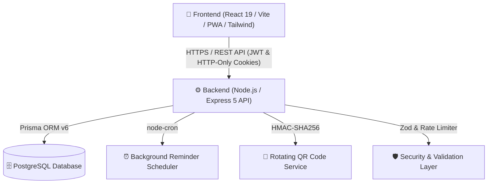

# 🎓 CampusConnect v2.0 — Centralized Learning Community & Event Platform

[](https://github.com/patilritesh2006-lgtm/CampusConnect/actions)
[](https://opensource.org/licenses/MIT)
[](https://github.com/patilritesh2006-lgtm/CampusConnect/issues)
[](https://reactjs.org/)
[](https://tailwindcss.com/)
[](https://nodejs.org/)
[](https://www.prisma.io/)
[](https://www.postgresql.org/)
[](https://web.dev/progressive-web-apps/)

> **CampusConnect** is an enterprise-grade, full-stack college event and student activity ecosystem. It transforms campus life through **time-based rotating QR check-ins**, **verified digital credentials with LinkedIn integration**, **an AI-powered Campus Assistant & Recommendation engine**, **public digital portfolios**, **campus gamification with XP leaderboards**, **automated reminder schedulers**, and **role-based administrative analytics**.

---

## 📑 Table of Contents
1. [System Architecture](#-system-architecture)
2. [Screenshots Preview](#-screenshots-preview)
3. [Key Highlights & Features](#-key-highlights--features)
4. [Tech Stack](#-tech-stack)
5. [Quick Start Guide](#-quick-start-guide)
6. [Demo Accounts (Local Dev Only)](#-local-development-only--demo-accounts)
7. [Running Automated Tests](#-running-automated-tests)
8. [Mobile LAN & PWA Guide](#-mobile-lan--pwa-testing)
9. [REST API Reference](#-rest-api-summary)
10. [Contributing & Community](#-contributing--community)
11. [License](#-license)

---

## 🏗️ System Architecture



---

## 📸 Screenshots Preview

| Student Dashboard 2.0 | Interactive Event Calendar |
| :---: | :---: |
|  <br> *Activity metrics, XP progress bar, quick QR scanner, and AI recommendations* |  <br> *Campus-wide monthly schedule with category filters and event modals* |

| Verified Digital Certificate | Administrative Analytics |
| :---: | :---: |
|  <br> *Cryptographic credential with QR verification & LinkedIn Add-to-Profile* |  <br> *Student Engagement Scores (0-100), department metrics, and attendance trends* |

---

## 🌟 Key Highlights & Features

### 1. 🔐 Enterprise Authentication & Security (Phase 1 & 21)
* **Dual-Token Architecture**: Short-lived Access Tokens (15 min) + Secure, HTTP-only, `SameSite` Refresh Tokens stored hashed in PostgreSQL.
* **Token Rotation**: Refresh tokens are automatically rotated and old tokens revoked upon refresh to prevent replay attacks.
* **Account Lockout Protection**: Automatically locks accounts for 15 minutes after 5 consecutive failed login attempts.
* **Multi-Device Revocation**: Incrementing `tokenVersion` on password reset or `/api/auth/logout-all` immediately invalidates all active sessions.
* **Input Validation & Sanitization**: Strict Zod schema validation on all payloads.
* **Production Hardening**: `helmet` secure headers, `express-rate-limit` (auth + general limiters), centralized `errorHandler`, and `/api/health` monitoring.

### 2. 🛡️ 5-Role Role-Based Access Control (Phase 2)
* Support for 5 specialized roles:
  * `SUPER_ADMIN`: Institution-wide management and configuration.
  * `ADMIN`: Event approvals, analytics, and college management.
  * `FACULTY`: Academic events, department rosters, and student oversight.
  * `EVENT_COORDINATOR`: Live rotating QR projection, attendance management, and media uploads.
  * `STUDENT`: Registrations, check-in scanning, digital portfolio, and certificates.

### 3. 📱 Dynamic Rotating QR Event Check-In (Phase 3)
* **Fraud-Proof QR Rotation**: Event organizers project a live QR code that rotates every 30 seconds signed with time-bucketed HMAC-SHA256 tokens to prevent screenshot sharing.
* **In-App QR Scanner**: Students scan or enter the live token to record verified attendance, receiving **+50 XP** immediately.
* **Bulk Roll Call & CSV Export**: One-click mass check-in and attendance roster CSV download.

### 4. 📜 Verifiable Digital Certificates with LinkedIn Sharing (Phase 4)
* **Cryptographic Certificate Codes**: Unique identifiers (e.g. `CC-2026-AIHA-7F3A9C`).
* **Public Verification Portal**: Zero-login credential lookup at `/verify-certificate/:certificateCode`.
* **1-Click LinkedIn Add-To-Profile**: Automatically fills credential title, issuing organization, issue date, and direct verification link on LinkedIn.

### 5. 📊 Advanced Analytics & Engagement Scoring (Phase 5)
* **Student Engagement Score (0–100)**: Weighted algorithm computing student participation based on attendance rate, event volume, certificates earned, and XP level.
* **Department Insights**: Live breakdown of student registrations, attendance percentage, and fill rate across academic departments.

### 6. ⏰ Automated Event Reminder Schedulers (Phase 6)
* Background cron jobs (`node-cron`) automatically send alerts to registered students at **24 hours** and **1 hour** before events start.

### 7. 🌐 Public Student Digital Portfolio (Phase 7)
* Publicly shareable student portfolio at `/portfolio/:username`.
* Showcases verified skills, attendance history, verified certificates, and unlocked badges with **zero sensitive PII leaks** (no emails, phone numbers, or passwords exposed).
* Student privacy toggle to switch portfolio between public and private.

### 8. 🤖 AI Campus Assistant & Smart Recommendations (Phase 8)
* **Personalized Recommendations**: Analyzes student department, skills, and past event history to compute match percentages (e.g. `95% Match`).
* **Interactive AI Assistant**: Global drawer assistant in the bottom right corner answering natural-language queries about events, hackathons, attendance, and certificates.

### 9. ⭐ Event Feedback & Surveys (Phase 9)
* 1–5 star ratings, structured experience evaluations, and recommendations.
* Submitting feedback awards students **+25 XP**.

### 10. 🎮 Gamification & Campus Leaderboard (Phases 11 & 12)
* Live XP progress bar and Level badge (`Level X` $\rightarrow$ `Level X+1`).
* Campus-wide Leaderboard (`/leaderboard`) ranking top achievers.

---

## 🛠️ Tech Stack

| Layer | Technologies |
| :--- | :--- |
| **Frontend** | React 19, Vite, Tailwind CSS v4, Lucide React, Axios, React Router v7, Vitest, React Testing Library |
| **Backend** | Node.js, Express 5, Prisma ORM v6, Jest, Supertest, node-cron, helmet, express-rate-limit, cookie-parser, zod |
| **Database** | PostgreSQL |
| **Security** | JWT (Dual-Token + Rotation), bcrypt, HMAC-SHA256, HTTP-only Cookies |
| **Cross-Platform** | Progressive Web App (PWA), Docker, Docker Compose, Nginx |

---

## 🚀 Quick Start Guide

### 1. Clone the Repository
```bash
git clone https://github.com/patilritesh2006-lgtm/CampusConnect.git
cd CampusConnect
```

---

### 2. Backend Setup
```bash
cd backend
npm install

# Setup environment variables (see .env.example)
cp .env.example .env

# Push schema to PostgreSQL database & generate client
npx prisma db push
npx prisma generate

# Seed realistic demo data (Admin, Faculty, Coordinator, Students, Events)
npm run seed

# Start Backend Server
npm run dev
```
*Backend runs on `http://localhost:5000`.*

---

### 3. Frontend Setup
```bash
cd ../frontend
npm install

# Start Frontend Vite Server
npm run dev
```
*Frontend runs on `http://localhost:5173`.*

---

## ⚠️ Local Development Only — Demo Accounts

> **IMPORTANT**: In production environments, `JWT_SECRET` must be set to a long, cryptographically secure random string (min 32 characters). The default demo credentials below are generated by `npm run seed` strictly for local testing and demonstration. Never use these credentials in production.

**Password for all demo accounts**: `Password123!@#`

| Role | Email | Capabilities & Features |
| :--- | :--- | :--- |
| **Admin** | `admin@campusconnect.edu` | Full Analytics, Event Creation, Certificate Issuance, Notice Broadcasts |
| **Faculty** | `faculty@campusconnect.edu` | Academic Events, Department Rosters, Attendance Tracking |
| **Coordinator** | `coordinator@campusconnect.edu` | Live Rotating QR Projector, Attendance Management |
| **Student** | `student@campusconnect.edu` *(User: `riteshpatil`)* | Student Dashboard 2.0, QR Scanner, AI Assistant, Certificates, Public Portfolio |

---

## 🧪 Running Automated Tests

### Backend Unit & Integration Tests (Jest):
```bash
cd backend
npm test
```

### Frontend Component Tests (Vitest + React Testing Library):
```bash
cd frontend
npm test
```

---

## 📱 Mobile LAN & PWA Testing

1. Connect your PC and Mobile to the **same Wi-Fi**.
2. Open your mobile browser and navigate to:
   ```text
   http://<YOUR_LOCAL_IP>:5173
   ```
3. Tap **"Add to Home Screen"** or **"Install App"** in Chrome / Safari to install CampusConnect as a native mobile app.

---

## 📡 REST API Summary

### Authentication & Users
* `POST /api/auth/register` — Register student/admin account (Zod validated)
* `POST /api/auth/login` — Login with account lockout defense (dual-token)
* `POST /api/auth/refresh` — Silent token refresh with token rotation
* `POST /api/auth/logout` — Revoke single-device refresh token
* `POST /api/auth/logout-all` — Revoke all device sessions globally
* `GET  /api/auth/me` — Get authenticated user details
* `GET  /api/users/portfolio/:username` — Public student portfolio (PII-safe)
* `GET  /api/users/leaderboard` — Campus XP leaderboard
* `PUT  /api/users/profile` — Update bio, skills, and portfolio visibility

### Events & Attendance
* `GET  /api/events` — Get all events with category filters
* `POST /api/events` — Create new event *(Admin/Coordinator)*
* `GET  /api/attendance/events/:id/rotating-qr` — Live 30s rotating QR token *(Admin/Coordinator)*
* `POST /api/attendance/checkin-qr` — Student QR scan attendance (+50 XP)
* `POST /api/attendance/mark` — Toggle single student attendance
* `POST /api/attendance/mark-all` — Bulk check-in
* `GET  /api/attendance/events/:id/export-csv` — Export attendance roster CSV

### Certificates
* `POST /api/certificates/issue` — Issue verified certificate (+100 XP)
* `POST /api/certificates/bulk-issue` — Bulk issue certificates to attended students
* `GET  /api/certificates/my-certificates` — Student earned certificates
* `GET  /api/certificates/verify/:code` — **Public** certificate verification & LinkedIn link

### AI & Feedback
* `GET  /api/ai/recommendations` — Personalized event match scores
* `POST /api/ai/assistant` — Natural-language campus assistant
* `POST /api/feedback/events/:id/feedback` — Submit 5-star review (+25 XP)
* `GET  /api/feedback/events/:id/feedback` — Aggregated event ratings

### Health & Monitoring
* `GET  /api/health` — DB latency, uptime, version, and memory status

---

## 🤝 Contributing & Community

Contributions are welcome! Please read [CONTRIBUTING.md](CONTRIBUTING.md) and [CODE_OF_CONDUCT.md](CODE_OF_CONDUCT.md) before submitting pull requests.

---

## 📄 License
This project is open-source and available under the [MIT License](LICENSE).
