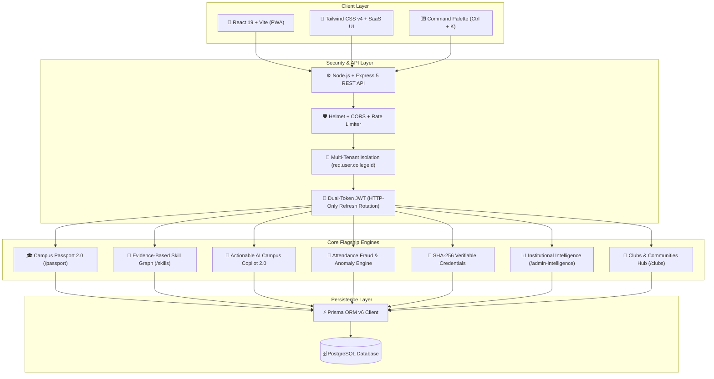
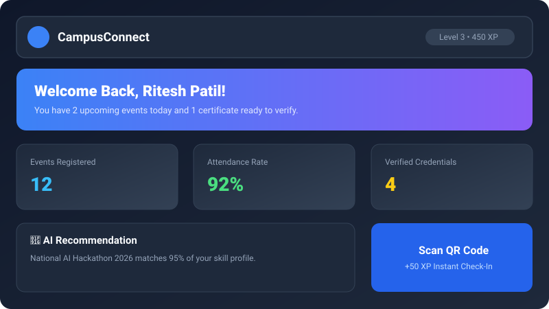
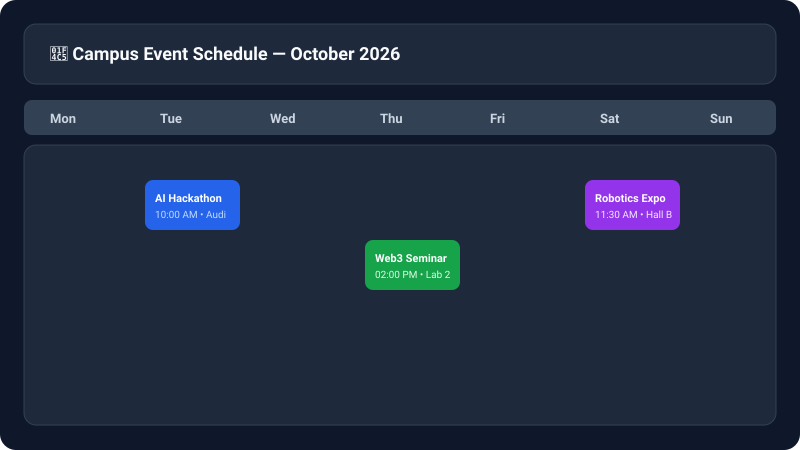
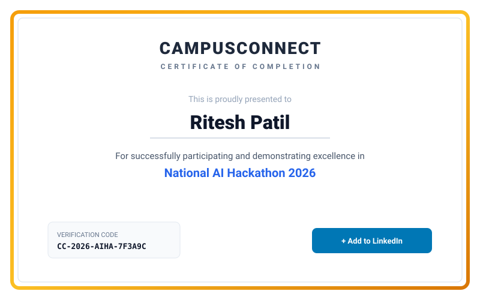

<p align="center">
  
</p>

<h1 align="center">🎓 CampusConnect v3.1 — AI-Powered Digital Campus Engagement & Verifiable Credential Platform</h1>

<p align="center">
  <a href="https://github.com/patilritesh2006-lgtm/CampusConnect/actions"></a>
  <a href="https://opensource.org/licenses/MIT"></a>
  <a href="https://github.com/patilritesh2006-lgtm/CampusConnect/issues"></a>
  <a href="https://reactjs.org/"></a>
  <a href="https://tailwindcss.com/"></a>
  <a href="https://nodejs.org/"></a>
  <a href="https://www.prisma.io/"></a>
  <a href="https://www.postgresql.org/"></a>
  <a href="https://web.dev/progressive-web-apps/"></a>
</p>

> **CampusConnect v3.1** is an enterprise-grade digital campus platform connecting:  
> **Student Participation → Verified Attendance → Skills → Achievements → Credentials → Campus Passport → Recruiter Verification → Institutional Intelligence**.

---

## 📑 Table of Contents
1. [The Connected Value Loop](#-the-connected-value-loop)
2. [System Architecture](#-system-architecture)
3. [Flagship Systems in v3.1](#-flagship-systems-in-v31)
4. [Screenshots Preview](#-screenshots-preview)
5. [Tech Stack](#-tech-stack)
6. [Quick Start Guide](#-quick-start-guide)
7. [Demo Accounts (Local Dev Only)](#-local-development-only--demo-accounts)
8. [Automated Testing & Build Verification](#-automated-testing--build-verification)
9. [REST API Reference](#-rest-api-reference)
10. [License](#-license)

---

## 🔄 The Connected Value Loop

```text
[Student Participation]
        ↓
[30s Rotating QR Check-In]
        ↓
[Verified Skill Graph & +XP]
        ↓
[Automated Achievements & Badges]
        ↓
[SHA-256 Verifiable Credentials]
        ↓
[Digital Campus Passport]
        ↓
[Recruiter & Employer Verification]
```

---

## 🏗️ System Architecture



---

## 🌟 Flagship Systems in v3.1

### 1. 🎓 Campus Passport 2.0 (`/passport` & `/passport/:username`)
* **Live Engagement Score (0–100)**: Computed transparently from verified attendance volume, credentials, unlocked achievements, and contribution hours.
* **Verified Experience Timeline**: Displays specific contribution roles (`Speaker`, `Organizer`, `Volunteer`, `Winner`, `Attendee`) with verified hours and certificate codes.
* **Granular Privacy Controls**: Live drawer for students to toggle visibility for skills, credentials, achievements, events, and email on public views.
* **Print & PDF Summary**: 1-click printer-friendly report for employer interviews.

### 2. 🎯 Evidence-Based Student Skill Graph (`/skills`)
* **Transparent Scoring Formula**:
  $$\text{Score} = \min(100, 35 + \text{EvidenceCount} \times 15 + \text{Bonus})$$
* **Proficiency Tiers**: `EXPERT` (90%+), `ADVANCED` (75-89%), `INTERMEDIATE` (55-74%), `BEGINNER` (<55%).
* **Project Evidence Submission**: Students submit personal capstone and coding assessment links to back up competencies.

### 3. 🧠 Actionable AI Campus Copilot 2.0 (`/api/ai/copilot`)
* **Direct Action Execution**: Students can say *"Register me for #1"* or *"Sign me up for the Python workshop"*, and Copilot registers the student directly.
* **Internship Readiness Audit**: Evaluates Technical Skills (%), Projects (%), Leadership (%), Communication (%), and Verified Experience (%) with **Top 3 Actionable Next Steps**.
* **Explainable Event Matchmaking**: Clarifies why events were recommended.

### 4. 🚨 Multi-Factor Attendance Fraud Detection Engine (`/admin-fraud`)
* **Deterministic Risk Matrix**:
  * QR Replay: `+30 pts`
  * Multiple rapid failed attempts: `+15 pts`
  * Impossible timing / velocity: `+20 pts`
  * Device mismatch during session: `+15 pts`
  * Duplicate scan bursts: `+40 pts`
* **Admin Review Console**: 1-click **Approve & Check-In**, **Confirm Fraud & Block**, and **Dismiss**.

### 5. 📜 Cryptographic Verifiable Credentials (`/verify/credential/:id`)
* **Tamper-Proof Proof**: Every credential is cryptographically stamped with a unique SHA-256 hash (`CRED-2026-XXXX-YYYY`).
* **Public Verification Registry**: Live verification with instant revocation audit trails and 1-click **Add to LinkedIn Profile**.

### 6. 💼 Recruiter Verification Portal (`/verify/student/:username`)
* **High-Speed Employer Console**: Distraction-free candidate verification interface displaying verified competencies, certifications, and institutional backing with **zero PII leaks**.

### 7. 📊 Campus Command Center & Institutional Intelligence (`/admin-intelligence`)
* **Executive Metrics**: Active events, check-in conversion rates, attendance alerts, and department engagement rankings with under-participating student detection.

### 8. ⌨️ Global Command Palette (`Ctrl + K`) & 3-Step Student Onboarding
* **Command Palette**: Press `Ctrl + K` or `Cmd + K` for instant keyboard navigation across events, skills, clubs, certificates, passport, and settings.
* **Onboarding Wizard**: 3-step interactive personalization wizard on first login.

---

## 📸 Screenshots Preview

| Student Campus Passport 2.0 | Verified Skill Graph |
| :---: | :---: |
|  <br> *Engagement Score (87/100), verified roles timeline, XP level, and privacy controls* |  <br> *Transparent evidence scoring, competency categories, and project submissions* |

| Cryptographic Credential Verification | Institutional Intelligence Command Center |
| :---: | :---: |
|  <br> *SHA-256 integrity hash verification with 1-click LinkedIn export* |  <br> *Command Center metrics, department participation matrix, and AI trend insights* |

---

## 🛠️ Tech Stack

| Layer | Technologies |
| :--- | :--- |
| **Frontend** | React 19, Vite, Tailwind CSS v4, Lucide React, Axios, React Router v7, Vitest, React Testing Library |
| **Backend** | Node.js, Express 5, Prisma ORM v6, Jest, Supertest, node-cron, helmet, express-rate-limit, cookie-parser, zod |
| **Database** | PostgreSQL |
| **Security** | Dual-Token JWT (Rotation), bcrypt, HMAC-SHA256, SHA-256 Credentials, Multi-Tenant Boundary |
| **Cross-Platform** | Progressive Web App (PWA), Docker, Docker Compose, Nginx |

---

## 🚀 Quick Start Guide

### 1. Clone the Repository
```bash
git clone https://github.com/patilritesh2006-lgtm/CampusConnect.git
cd CampusConnect
```

### 2. Backend Setup
```bash
cd backend
npm install

# Push schema to PostgreSQL & generate client
npx prisma db push
npx prisma generate

# Seed realistic demo data
npm run seed

# Start Backend Server (Port 5000)
npm run dev
```

### 3. Frontend Setup
```bash
cd ../frontend
npm install

# Start Frontend Vite Server (Port 5173)
npm run dev
```

* **Web Application**: [http://localhost:5173](http://localhost:5173)  
* **Campus Passport**: [http://localhost:5173/passport](http://localhost:5173/passport)  
* **Swagger API Docs**: [http://localhost:5000/api-docs](http://localhost:5000/api-docs)  
* **API Health Check**: [http://localhost:5000/api/health](http://localhost:5000/api/health)

---

## ⚠️ Local Development Only — Demo Accounts

> **Password for all seed accounts**: `Password123!@#`

| Role | Email | Best Features to Demo |
| :--- | :--- | :--- |
| **Student** | `student@campusconnect.edu` *(User: `riteshpatil`)* | **Campus Passport (`/passport`)**, **Skill Graph (`/skills`)**, **AI Copilot 2.0**, **Clubs (`/clubs`)** |
| **Admin** | `admin@campusconnect.edu` | **Command Center (`/admin-intelligence`)**, **Fraud Console (`/admin-fraud`)**, **AI Event Creator** |
| **Faculty** | `faculty@campusconnect.edu` | **Department Rosters**, **AI Event Blueprint Drafting** |
| **Coordinator** | `coordinator@campusconnect.edu` | **Rotating QR Attendance Projector (`/events`)**, **CSV Export** |
| **Recruiter** | _No Login Required_ | **Recruiter Verification (`/verify/student/riteshpatil`)**, **Credential Verification (`/verify/credential/CRED-2026-AI-ARCH-7F8A`)** |

---

## 🧪 Automated Testing & Build Verification

```text
======================= BACKEND JEST SUITE =======================
PASS tests/auth.test.js
PASS tests/controllers.test.js
PASS tests/master.test.js
PASS tests/v3_suite.test.js

Test Suites: 4 passed, 4 total
Tests:       39 passed, 39 total (100% Passing)

======================= FRONTEND VITEST SUITE =====================
PASS src/components/NotificationBell.test.jsx
PASS src/components/AIAssistant.test.jsx

Test Files:  2 passed, 2 total
Tests:       2 passed, 2 total (100% Passing)

======================= VITE PRODUCTION BUILD =====================
✓ built in 961ms (0 errors)
```

---

## 📡 REST API Reference

### 🎓 Campus Passport & Privacy
* `GET  /api/passport/me` — Authenticated student's Campus Passport
* `GET  /api/passport/:username` — Public verified passport (Zero PII leaks)
* `PUT  /api/passport/privacy` — Update granular privacy settings
* `POST /api/passport/onboarding` — Save 3-step onboarding preferences

### 🎯 Skills & Evidence
* `GET  /api/skills` — Full student skill graph & evidence items
* `POST /api/skills/evidence` — Add project or workshop skill evidence

### 📜 Cryptographic Credentials
* `POST /api/credentials/issue` — Issue SHA-256 cryptographically signed credential *(Admin/Faculty)*
* `GET  /api/credentials/my-credentials` — Student earned credentials
* `GET  /api/credentials/verify/:id` — **Public** cryptographic hash validation & LinkedIn link
* `POST /api/credentials/revoke` — Revoke credential with reason *(Admin)*

### 🚨 Attendance Fraud & Integrity
* `GET  /api/fraud/alerts` — High-risk attendance anomaly review queue *(Admin)*
* `POST /api/fraud/resolve` — Approve, confirm fraud, or dismiss incident *(Admin)*

### 🧠 AI Campus Copilot 2.0
* `POST /api/ai/copilot` — Actionable natural-language copilot & Internship Readiness Audit
* `POST /api/ai/event-draft` — Generate structured event blueprint *(Admin/Faculty)*

### 📊 Institutional Intelligence & Clubs
* `GET  /api/intelligence` — Campus Command Center KPIs & AI trend insights
* `GET  /api/clubs` — Campus clubs and student societies
* `POST /api/clubs/:id/join` — Join campus organization

---

## 📄 License
This project is open-source and available under the [MIT License](LICENSE).